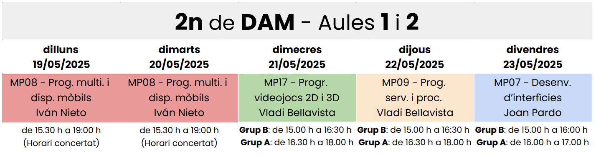
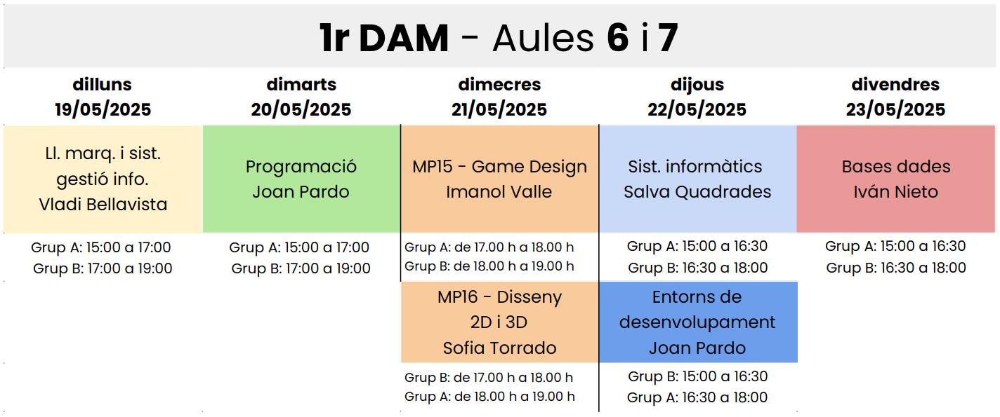
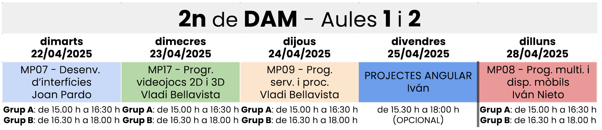
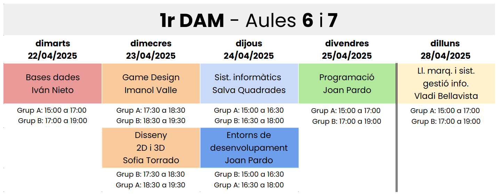
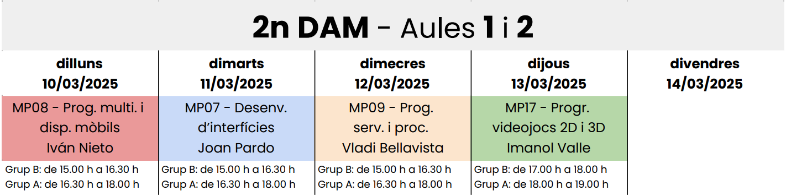
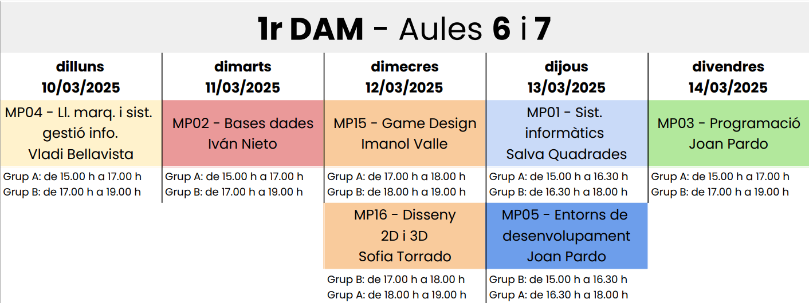
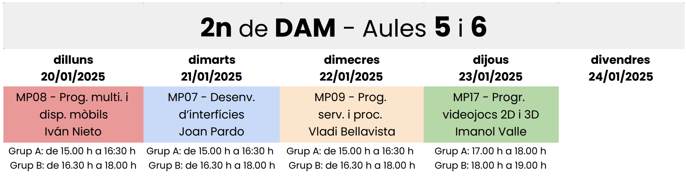
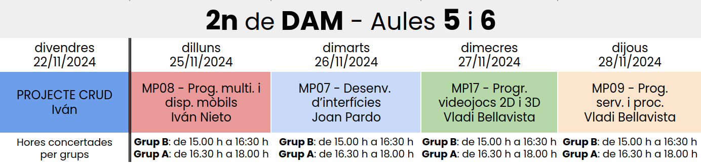
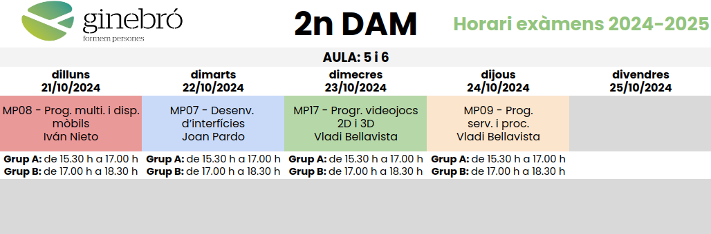

# Tutoria DAM2 curs 2024-2025

# Desenvolupament d'aplicacions multiplataforma (videojocs i oci digital)

Ìndex

### **1.** [Temes tutoria](#temes-tutoria)

### **2.** [Temes FCT](#temes-fct)

### **3.** [Grups per les setmanes d'exàmens](#grups-per-les-setmanes-dexàmens)

#### &nbsp;&nbsp;&nbsp;&nbsp;&nbsp;&nbsp;  **3.1.** [1a setmana d'exàmens](#1a-setmana-dexàmens)

## Temes Tutoria

#### [Horari](./horari-dam2-2024-2025.pdf)

#### [Curs 2024-2025 - Reunió informativa - 2n de DAM videojocs](./reunio-families-dam2-curs-2024-2025.pdf)

#### [Calendari](https://calendar.google.com/calendar/embed?src=c_0fdb75ac4a12020449ceee819dd9100fa7216a5b580b8b49064a3ec58135d5b4%40group.calendar.google.com&ctz=Europe%2FMadrid)

#### [Formulari pica-pica](https://forms.gle/ZehDY8qG8WpdgQUv7)

## Temes FCT

1. [Pla d'Activitats DAM](pla-d-activitats-dam.pdf)

1. [Formulari dades de l'empresa](https://docs.google.com/forms/d/1SP3yrdzbV2eXbzPK0fYHxTcMViiIIRzJzUUWpru14T4)

## Grups per les setmanes d'exàmens

|**Grup A**|**Grup B**|
|----|----|
|Blanch Martínez, David|Brillas Villanueva, Manel|
|Bosch López, Martí|Caritg Pardo, Alek|
|Calle López, Xavier|Clavijos Roger, Arnau|
|Cerezo Rossell, Pol|Ferro Torras, Iñaki|
|Corbacho Rodriguez, Oscar|Garcia Antunez, Ferran|
|Gallego Clavijo, Guillem|Giribet Vives, Sergi|
|Gonzalez Alcazar, Pol|Gómez Beato, Pol|
|Gonzalez Jimenez, Marti|Jara Duarte, Paula|
|Pavo Rodriguez , Alex|Julià Bosch, Jaume|
|Rubio López, Èric|Loriz Pou, Gerard|
|Sánchez Gras, Hector|Martinez Coll, Joan|
|Subirà Viñas, César|Vásquez Almeida, Anthony José|
|Vèlez Mañas, Raul||

## 6a setmana d'exàmens

### Horari de <u>dilluns</u> i <u>dimarts</u>

Horari concertat, de **`15.30 h`** a **`19.00 h`**

### Horari de <u>dimecres</u> i <u>dijous</u>

**Grup B** de **`15.00 h`** a **`16.30 h`** **Grup A** de **`16.30 h`** a **`18.00 h`**

### Horari de <u>divendres</u>

**Grup B** de **`15.00 h`** a **`16.00 h`** **Grup A** de **`16.00 h`** a **`17.00 h`**

Fitxer [DAM2-2024-2025-horari-6a-setmana-d-examens.pdf](./DAM2-2024-2025-horari-6a-setmana-d-examens.pdf)

### 6a setmana d'exàmens 1r de DAM

Us facilito també l'horari dels exàmens de 1r de DAM per aquells que hagueu de recuperar alguna unitat formativa.

Fitxer [DAM1-2024-2025-horari4a-setmana-d-examens.pdf](./DAM1-2024-2025-horari-6a-setmana-d-examens.pdf)

#### 5a setmana d'exàmens

##### Horari de <u>dimarts</u> a <u>dilluns</u>

**Grup A** de 15.00 h a 16.30 h **Grup B** de 16.30 h a 18.00 h

Fitxer [DAM2-2024-2025-horari-5a-setmana-d-examens.pdf](./DAM2-2024-2025-horari-5a-setmana-d-examens.pdf)

##### 5a setmana d'exàmens 1r de DAM

Us facilito també l'horari dels exàmens de 1r de DAM per aquells que hagueu de recuperar alguna unitat formativa.

Fitxer [DAM1-2024-2025-horari4a-setmana-d-examens.pdf](./DAM1-2024-2025-horari-5a-setmana-d-examens.pdf)

#### 4a setmana d'exàmens

##### Horari de <u>dilluns</u> a <u>dimecres</u>

**Grup B** de 15.00 h a 16.30 h **Grup A** de 16.30 h a 18.00 h

##### Horari de <u>dijous</u>

**Grup B** de 17.00 h a 18.00 h **Grup A** de 18.00 h a 19.00 h

Fitxer [DAM-2024-2025-horari-4a-setmana-d-examens.pdf](./DAM-2024-2025-horari-4a-setmana-d-examens.pdf)

##### 4a setmana d'exàmens 1r de DAM

Us facilito també l'horari dels exàmens de 1r de DAM per aquells que hagueu de recuperar alguna unitat formativa.

Fitxer [DAM1-2024-2025-horari4a-setmana-d-examens.pdf](./DAM1-2024-2025-horari-4a-setmana-d-examens.pdf)

#### 3a setmana d'exàmens

##### Horari de <u>dilluns</u> a <u>dimecres</u>

**Grup A** de 15.00 h a 16.30 h **Grup B** de 16.30 h a 18.00 h

##### Horari de <u>dijous</u>

**Grup A** de 17.00 h a 18.00 h **Grup B** de 18.00 h a 19.00 h

Fitxer [DAM-2024-2025-horari3a-setmana-d-examens.pdf](./DAM-2024-2025-horari-3a-setmana-d-examens.pdf)

### 2a setmana d'exàmens

**Grup B** de 15.00 h a 16.30 h **Grup A** de 16.30 h a 19.00 h

Fitxer [DAM-2024-2025-horari-2a-setmana-d-examens.pdf](./DAM-2024-2025-horari-2a-setmana-d-examens.pdf)

### 1a setmana d'exàmens

**Grup A** de 15.30 h a 17.00 h       **Grup B** de 17.00 h a 18.30 h

Fitxer [DAM-2024-2025-horari-1a-setmana-d-examens.pdf](./DAM-2024-2025-horari-1a-setmana-d-examens.pdf)